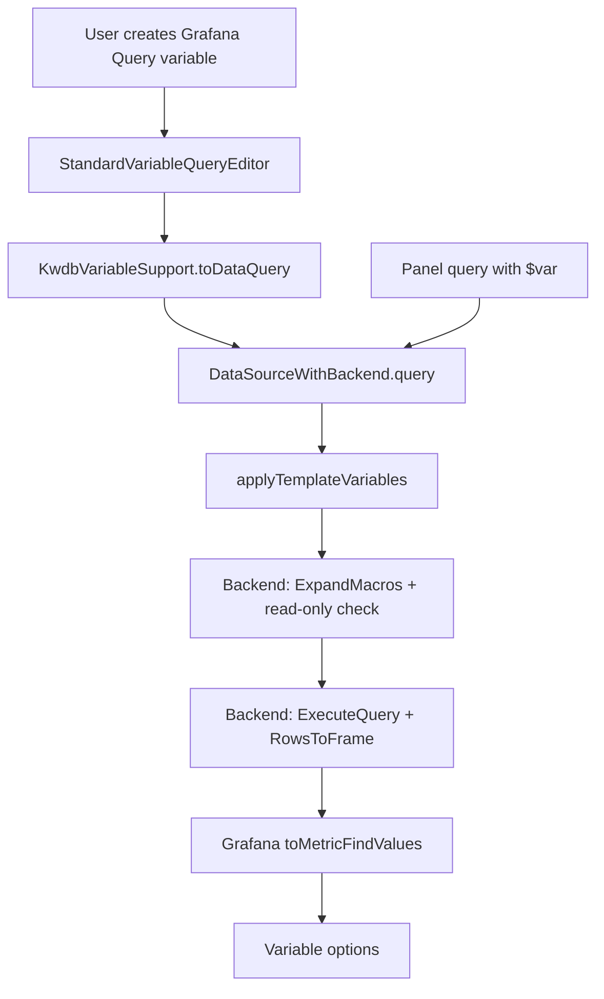

# KWDB Grafana Data Source - Variable Ecosystem Design

**Date:** 2026-08-06
**Status:** Approved by stakeholder, pending spec review
**Plugin type:** Grafana data source plugin (frontend)

## 1. Overview

This spec adds variable ecosystem support to the KWDB TSDB Grafana data source
plugin. Phase 1 enables Grafana Query variables and panel query interpolation:
users can write read-only SQL in a Grafana Query variable, get string values as
variable options, and use `$var` in any query mode of the plugin.

The design follows the modern Grafana `StandardVariableSupport` API instead of
the legacy `metricFindQuery`-only path. Variable queries run through the
existing backend query pipeline, so macro expansion, read-only enforcement,
SQL execution, and Data Frame conversion are reused without backend changes.

## 2. Scope

### 2.1 In scope

- Query variables that execute read-only SQL against KWDB.
- Panel query interpolation for all existing query modes through `rawSql`.
- Multi-value variables formatted as SQL string literals by default.
- Preservation of plugin-specific time macros for backend expansion.
- Unit tests and an E2E test covering a variable-driven dashboard query.

### 2.2 Out of scope

- Custom variable query editor with table/column pickers.
- Ad Hoc filter variables and `getTagKeys` / `getTagValues`.
- Default dashboard variables or dashboard links.
- Changes to the Go backend.

These are follow-up phases. The selected architecture intentionally keeps the
interfaces small so the follow-ups can be added without reworking Phase 1.

## 3. Architecture

### 3.1 Components

**`src/variableSupport.ts` (new)**

Defines `KwdbVariableSupport extends StandardVariableSupport<KwdbDataSource>`.
The class only implements `toDataQuery(query: StandardVariableQuery)`:

```ts
toDataQuery(query: StandardVariableQuery): KwdbQuery {
  return {
    refId: query.refId ?? 'variable-query',
    mode: 'raw',
    format: 'table',
    rawSql: query.query,
  };
}
```

`StandardVariableSupport` lets Grafana reuse its standard text-based variable
query editor. The resulting `KwdbQuery` is submitted through
`DataSourceWithBackend.query`, which already applies
`applyTemplateVariables` before sending the query to the backend.

**`src/datasource.ts` (modified)**

- Inject `TemplateSrv` in the constructor for testability:
  `constructor(instanceSettings, private readonly templateSrv: TemplateSrv = getTemplateSrv())`.
- Assign `this.variables = new KwdbVariableSupport(this)`.
- Override `applyTemplateVariables(query, scopedVars)` to interpolate
  `query.rawSql`:

```ts
applyTemplateVariables(query: KwdbQuery, scopedVars: ScopedVars): KwdbQuery {
  if (!query.rawSql) {
    return query;
  }
  return {
    ...query,
    rawSql: this.templateSrv.replace(query.rawSql, scopedVars, 'sqlstring'),
  };
}
```

No backend changes are required. The existing `QueryModel` already reads
`rawSql`, and the existing `filterQuery` accepts raw queries with non-empty SQL.

### 3.2 Data flow



Grafana's `StandardQueryRunner` calls `datasource.variables.toDataQuery`, then
`runRequest` through `datasource.query`. `DataSourceWithBackend.query` calls
`applyTemplateVariables` on every target, including variable queries, which
also enables cascading variables. The backend expands `$__timeFilter`,
`$__timeFrom`, `$__timeTo`, and `$__timeGroup` after frontend interpolation.

Grafana's `toMetricFindValues` operator turns the returned frame into variable
options. A query such as `SELECT DISTINCT device_id FROM demo_ts.sensors`
returns a string field that becomes the variable options. Queries returning
`text` and `value` string columns are also mapped by the standard operator.

## 4. Variable formatting

`applyTemplateVariables` uses the Grafana `sqlstring` format as the default:

- `$device` becomes `'device-1'`.
- Multi-value `$device` becomes `'device-a','device-b'`.
- Single quotes inside values are escaped as SQL string literals.

Users can override formatting inline:

- `${var:raw}` for raw values.
- `${var:doublequote}` for double-quoted identifiers.

Plugin-specific macros such as `$__timeFilter(ts)`, `$__timeFrom`,
`$__timeTo`, and `$__timeGroup` are not registered Grafana variables, so
`TemplateSrv.replace` leaves them unchanged for the backend macro expander.

## 5. Error handling

- Non-read-only variable SQL is rejected by the backend with the same
  `SELECT/SHOW/EXPLAIN/WITH` guard as panel queries.
- SQL errors are returned through the normal query response and are displayed
  by Grafana's variable editor.
- Empty variable queries produce no options and do not error.
- Empty `rawSql` in a panel query is left unchanged by
  `applyTemplateVariables`; existing `filterQuery` behavior is preserved.

## 6. Testing

**Unit tests (`tests/variableSupport.test.ts`)**

- `toDataQuery` maps `StandardVariableQuery` to a raw `KwdbQuery`.
- `applyTemplateVariables` replaces a single-value variable.
- `applyTemplateVariables` formats multi-value variables with `sqlstring`.
- `applyTemplateVariables` preserves `$__timeFilter`, `$__timeFrom`,
  `$__timeTo`, and `$__timeGroup`.
- `applyTemplateVariables` returns the query unchanged when `rawSql` is empty.

**E2E (`tests-e2e/variables.spec.ts`)**

- Create a Grafana Query variable with
  `SELECT DISTINCT device_id FROM demo_ts.sensors`.
- Assert that variable options are populated.
- Run a panel query that references `$device` and assert data is returned.

The E2E test uses the same provisioned `KWDB TSDB` data source and table
overrides as the existing tests.

## 7. Documentation

Update `README.md`:

- Add a "Variables" section with Query variable examples.
- Document the default `sqlstring` formatting and inline format overrides.
- Document that Ad Hoc filters and a custom variable editor are follow-up
  phases.

## 8. Follow-up phases

1. **Custom variable editor**: use `CustomVariableSupport` with a SQL editor or
   a structured query builder.
2. **Ad Hoc filters**: implement `getTagKeys` and `getTagValues`, and inject
   `AdHocVariableFilter[]` into the generated SQL through
   `applyTemplateVariables`.
